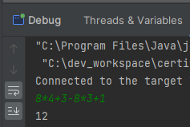

# Calculadora Simples

Um sistema simples baseado em terminal para contas matemáticas. Permite resolver operações de multiplicação, divisão, adição e subtração. As contas são realizadas utilizando o sistema de ordem de operações (PEMDAS).

## Funcionalidades

- Permite realizar contas extensas, desde que os números sejam de um algarismo.
- Permite adicionar, subtrair, dividir e multiplicar valores.
- Permite que contas subsequentes sejam realizadas.

## Futuro

- Permitir a operação com valores de mais algarismos.
- Tratamento de erros.
- Ajuste na legibilidade do código.
- Criar frontend.
- Utilização de parênteses.
